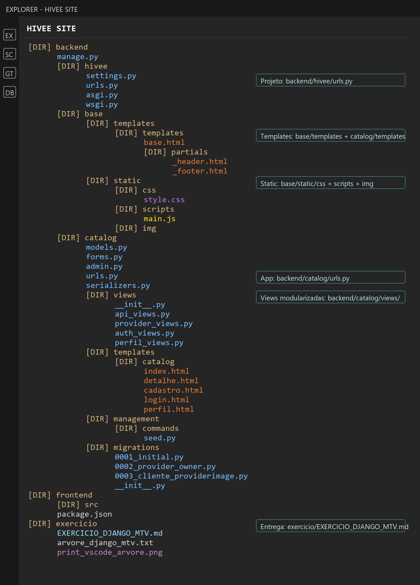

# Exercicio Django MTV - HIVEE

## Parte 1 - O Retrato

O projeto Django do HIVEE foi organizado com um backend Django/DRF em `backend/`, projeto principal `hivee/` e app principal `catalog/`. A camada Django MTV demonstrativa foi criada em rotas separadas (`/mtv/`) para conviver com o frontend React e com a API REST existente (`/api/`).

Arquivo complementar da arvore: [arvore_django_mtv.txt](arvore_django_mtv.txt)

## Parte 2 - O Porque

### A Modularizacao das Views

- O arquivo padrao `views.py` foi substituido por uma pasta `views/` porque um unico arquivo concentraria responsabilidades demais conforme o projeto cresce.
- `catalog/views/api_views.py` preserva a API REST ja existente em `/api/`, com categorias, cidades, estatisticas, prestadores, recomendacoes e autenticacao por token.
- `catalog/views/provider_views.py` cuida da camada MTV de prestadores: listagem, busca e detalhe.
- `catalog/views/auth_views.py` cuida do cadastro, login e logout do cliente da camada MTV.
- `catalog/views/perfil_views.py` cuida da edicao de perfil, checagem de sessao e delecao logica da conta.
- O arquivo `catalog/views/__init__.py` exporta as views necessarias para que as rotas continuem simples.
- A vantagem para o futuro e manutencao: cada arquivo tem uma responsabilidade clara, fica mais facil testar, encontrar erros, adicionar novas telas e evitar que uma alteracao pequena quebre partes nao relacionadas.

### O Padrao MTV

- Models: ficam em `backend/catalog/models.py`. Eles representam a estrutura e regras principais do banco de dados, como `Category`, `Provider`, `ProviderImage` e `Cliente`.
- Templates: ficam em `backend/base/templates/` e `backend/catalog/templates/catalog/`. Eles representam a interface HTML renderizada pelo Django, como listagem, detalhe, cadastro, login e perfil.
- Views: ficam em `backend/catalog/views/`. Elas recebem a requisicao, consultam os models, usam forms quando necessario e devolvem templates ou respostas JSON.
- Forms: ficam em `backend/catalog/forms.py`. Eles validam os dados enviados pelo usuario antes de salvar no banco, como confirmacao de senha e edicao de perfil.
- Rotas do projeto: ficam em `backend/hivee/urls.py`, que e a porta de entrada global.
- Rotas do app: ficam em `backend/catalog/urls.py`, onde estao separadas as rotas MTV (`/mtv/`) e as rotas REST (`/api/`).

### A pasta static/ vs templates/

- `templates/` guarda arquivos HTML que o Django processa antes de enviar ao navegador.
- Nos templates entram blocos, heranca com ``, includes, variaveis de contexto, formularios, mensagens e ``.
- `static/` guarda arquivos publicos que nao precisam ser renderizados pelo Django, como CSS, JavaScript, imagens fixas e assets visuais.
- No HIVEE, `backend/base/static/css/style.css` guarda o estilo da camada MTV e `backend/base/static/scripts/main.js` guarda o comportamento simples de interface, como remover alertas e confirmar delecao de conta.
- Em resumo: `templates/` e para HTML dinamico; `static/` e para arquivos estaticos servidos como assets.

### As Rotas

- `backend/hivee/urls.py` deve ficar como arquivo global do projeto, responsavel por incluir apps e rotas principais.
- `backend/catalog/urls.py` concentra as rotas do app `catalog`, deixando o projeto principal mais limpo.
- Essa separacao evita um `urls.py` global gigante, dificil de ler e manter.
- Tambem facilita reutilizar o app, testar rotas isoladamente e evoluir a aplicacao por responsabilidade.
- No HIVEE, essa decisao permite que a API REST e a camada MTV coexistam sem conflito: `/api/` continua servindo o frontend React e `/mtv/` serve as paginas Django classicas do exercicio.

